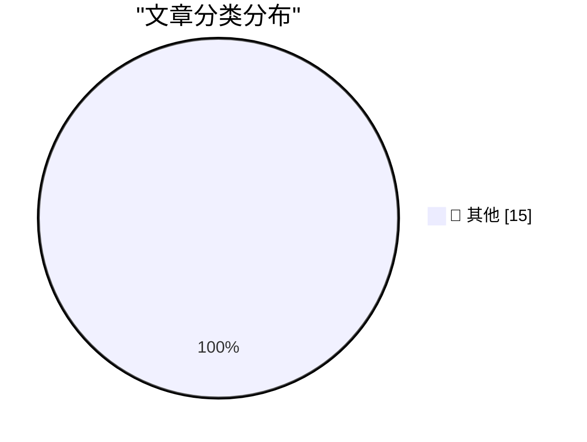

# 📰 AI 博客每日精选 — 2026-03-03

> 来自 Karpathy 推荐的 92 个顶级技术博客，AI 精选 Top 15

## 📝 今日看点

今日看点：AI 正在加速融入开发流程，从身份验证集成到 LLM 的人格化设计，都体现了提升效率和用户体验的趋势。同时，WebAssembly 等技术也在持续优化前端性能，而经典设计理念，如 Flickr 的 URL 方案，依然值得借鉴和反思。此外，围绕数据抓取和平台竞争的法律纠纷也值得关注。

---

## 🏆 今日必读

🥇 **使用WebAssembly和Gifsicle的GIF优化工具**

[GIF optimization tool using WebAssembly and Gifsicle](https://simonwillison.net/guides/agentic-engineering-patterns/gif-optimization/#atom-everything) — simonwillison.net · 11 小时前 · 📝 其他

> 该文章介绍了一种使用WebAssembly和Gifsicle优化GIF图像大小的工具。作者经常在文章中使用LICEcap录制的GIF动画，但文件体积较大。该工具利用Gifsicle在WebAssembly环境中的高效处理能力，旨在减少GIF文件的大小，从而提升网页加载速度和用户体验。通过此工具，用户可以更方便地在网络内容中嵌入高质量且体积较小的GIF动画。此工具的开发体现了利用现代Web技术优化传统图像格式的潜力。

💡 **为什么值得读**: 如果你需要在网页中嵌入高质量的GIF动画，并希望优化其文件大小，这篇文章介绍的工具和思路值得参考。

🥈 **二月赞助者专属新闻通讯**

[February sponsors-only newsletter](https://simonwillison.net/2026/Mar/2/february-newsletter/#atom-everything) — simonwillison.net · 13 小时前 · 📝 其他

> 这是一篇面向赞助者的每月新闻通讯，主要内容包括OpenClaw的进展和Claws相关信息，作者启动了一个关于Agentic Engineering的非正式书籍项目，以及介绍了StrongDM、Showboat和Rodney等项目。此外，还提到了Kākāpō（鸮鹦鹉）的繁殖季节。该通讯旨在向赞助者提供作者近期的工作进展和关注点。订阅赞助者可以访问完整内容。

💡 **为什么值得读**: 如果你是作者的赞助者，或者对作者的工作和项目感兴趣，这篇新闻通讯提供了第一手的更新信息。

🥉 **我制作了一个品脱大小的Macintosh**

[I built a pint-sized Macintosh](https://www.jeffgeerling.com/blog/2026/pint-sized-macintosh-pico-micro-mac/) — jeffgeerling.com · 6 小时前 · 📝 其他

> 这篇文章介绍了作者使用树莓派 Pico 制作一个微型 Macintosh 的项目。该项目基于 Matt Evans 的 Pico Micro Mac，运行 System 5.3 操作系统。作者主要负责组装硬件部分，并展示了运行效果。这个项目是为 MARCHintosh 活动准备的，展示了使用低成本硬件重现经典 Macintosh 体验的可能性。

💡 **为什么值得读**: 如果你对复古计算、树莓派 Pico 以及 Macintosh 模拟感兴趣，这个项目是一个有趣的实践案例。

---

## 📊 数据概览

| 扫描源 | 抓取文章 | 时间范围 | 精选 |
|:---:|:---:|:---:|:---:|
| 88/92 | 2500 篇 → 25 篇 | 24h | **15 篇** |

### 分类分布

---

## 📝 其他

### 1. 使用WebAssembly和Gifsicle的GIF优化工具

[GIF optimization tool using WebAssembly and Gifsicle](https://simonwillison.net/guides/agentic-engineering-patterns/gif-optimization/#atom-everything) — **simonwillison.net** · 11 小时前 · ⭐ 15/30

> 该文章介绍了一种使用WebAssembly和Gifsicle优化GIF图像大小的工具。作者经常在文章中使用LICEcap录制的GIF动画，但文件体积较大。该工具利用Gifsicle在WebAssembly环境中的高效处理能力，旨在减少GIF文件的大小，从而提升网页加载速度和用户体验。通过此工具，用户可以更方便地在网络内容中嵌入高质量且体积较小的GIF动画。此工具的开发体现了利用现代Web技术优化传统图像格式的潜力。

---

### 2. 二月赞助者专属新闻通讯

[February sponsors-only newsletter](https://simonwillison.net/2026/Mar/2/february-newsletter/#atom-everything) — **simonwillison.net** · 13 小时前 · ⭐ 15/30

> 这是一篇面向赞助者的每月新闻通讯，主要内容包括OpenClaw的进展和Claws相关信息，作者启动了一个关于Agentic Engineering的非正式书籍项目，以及介绍了StrongDM、Showboat和Rodney等项目。此外，还提到了Kākāpō（鸮鹦鹉）的繁殖季节。该通讯旨在向赞助者提供作者近期的工作进展和关注点。订阅赞助者可以访问完整内容。

---

### 3. 我制作了一个品脱大小的Macintosh

[I built a pint-sized Macintosh](https://www.jeffgeerling.com/blog/2026/pint-sized-macintosh-pico-micro-mac/) — **jeffgeerling.com** · 6 小时前 · ⭐ 15/30

> 这篇文章介绍了作者使用树莓派 Pico 制作一个微型 Macintosh 的项目。该项目基于 Matt Evans 的 Pico Micro Mac，运行 System 5.3 操作系统。作者主要负责组装硬件部分，并展示了运行效果。这个项目是为 MARCHintosh 活动准备的，展示了使用低成本硬件重现经典 Macintosh 体验的可能性。

---

### 4. 赋予LLM人格只是良好的工程实践

[Giving LLMs a personality is just good engineering](https://seangoedecke.com/giving-llms-a-personality/) — **seangoedecke.com** · 4 小时前 · ⭐ 15/30

> 文章探讨了赋予大型语言模型（LLM）人格化特征的合理性。作者认为，尽管有人担心这会导致用户高估AI能力，但赋予LLM适当的人格可以提高其可用性和用户体验。关键在于明确LLM的工具属性，避免过度拟人化。作者认为，在工程上合理地赋予LLM人格，可以使其在特定任务中表现得更有效率。

---

### 5. [赞助] npx workos：一个直接将身份验证写入代码库的AI代理

[[Sponsor] npx workos: An AI Agent That Writes Auth Directly Into Your Codebase](https://workos.com/docs/authkit/cli-installer?utm_source=tldrdev&amp;utm_medium=newsletter&amp;utm_campaign=q12026) — **daringfireball.net** · 3 小时前 · ⭐ 15/30

> npx workos 发布了一个由 Claude 提供支持的 AI 代理，它可以读取项目代码，检测框架，并将完整的身份验证集成直接写入现有代码库。它不是模板生成器，而是通过理解代码和技术栈，生成适配的集成方案。WorkOS 代理还会进行类型检查和构建，并将任何错误反馈给自己进行修复。

---

### 6. ★ HazeOver — 用于突出显示最前端窗口的 Mac 实用工具

[★ HazeOver — Mac Utility for Highlighting the Frontmost Window](https://daringfireball.net/2026/03/hazeover) — **daringfireball.net** · 4 小时前 · ⭐ 15/30

> HazeOver 是一款 Mac 实用工具，通过调暗所有背景窗口来突出显示当前活动窗口。它的功能简单直接，但能显著提升 MacOS 的日常使用体验。该工具专注于增强用户对当前工作焦点的感知，减少视觉干扰。

---

### 7. 无名英雄：Flickr 的 URL 方案

[Unsung Heroes: Flickr’s URLs Scheme](https://unsung.aresluna.org/unsung-heroes-flickrs-urls-scheme/) — **daringfireball.net** · 5 小时前 · ⭐ 15/30

> 文章赞扬了 Flickr 在 2000 年代后期使用的 URL 方案，该方案将 URL 作为用户界面的一部分，清晰地展示了照片、相册和用户的关系。例如，`flickr.com/photos/mwichary/favorites` 和 `flickr.com/photos/mwichary/54896695834/in/set-72177720330077904` 等 URL 简洁易懂，无需冗余的 `www.` 前缀。这种设计体现了对 URL 作为用户体验重要组成部分的深刻理解。

---

### 8. ChangeTheHeaders

[ChangeTheHeaders](https://underpassapp.com/news/2025/3/4.html) — **daringfireball.net** · 6 小时前 · ⭐ 15/30

> 文章讨论了一个问题：在 Safari 中将图像从网页拖出时，有时会得到 WebP 格式的图像，而作者更喜欢 PNG 和 JPEG 格式以保证兼容性。作者需要一种方法来控制或更改下载图像的格式。文章可能涉及解决方案或工具，以解决 Safari 浏览器下载图片格式不一致的问题。

---

### 9. 欢迎（回来）到 Macintosh

[Welcome (Back) to Macintosh](https://take.surf/2026/03/01/welcome-back-to-macintosh) — **daringfireball.net** · 7 小时前 · ⭐ 15/30

> 这篇文章表达了作者对 Macintosh 的期望，希望它不会像历史上那些衰落的帝国一样，因内斗、自满和缺乏远见而走向衰败。作者希望 Macintosh 能够保持其创新精神，并始终以用户需求为中心，而不是追逐潮流或过度简化。文章呼吁重新发现 Macintosh 的原始火花和天才之处。

---

### 10. SerpApi 提交了驳回 Google 诉讼的动议

[SerpApi Filed Motion to Dismiss Google’s Lawsuit](https://serpapi.com/blog/google-v-serpapi-motion-to-dismiss-why-were-in-the-right/) — **daringfireball.net** · 7 小时前 · ⭐ 15/30

> SerpApi 的 CEO Julien Khaleghy 宣布，该公司已提交动议，要求驳回 Google 对其提起的诉讼。SerpApi 认为 Google 的诉讼暗示 Google 认为自己拥有互联网，但实际上互联网是开放的。SerpApi 承诺将继续抗争，以保护其商业模式以及依赖其技术的开发者和研究人员。

---

### 11. Anthropic 和对齐

[‘Anthropic and Alignment’](https://stratechery.com/2026/anthropic-and-alignment/) — **daringfireball.net** · 9 小时前 · ⭐ 15/30

> Ben Thompson 在 Stratechery 上撰文，探讨了 AI 公司 Anthropic 在 AI 对齐问题上的立场，以及这可能带来的地缘政治影响。文章指出，如果一家私营公司开发了核武器，并试图以此来胁迫美国军方，美国绝对有动机摧毁该公司。国际法本质上是权力的体现，实力决定一切。某些能力，例如核武器，不能被允许私有化。

---

### 12. 华尔街日报：特朗普政府因护栏问题冷落 Anthropic，拥抱 OpenAI

[WSJ: ‘Trump Administration Shuns Anthropic, Embraces OpenAI in Clash Over Guardrails’](https://www.wsj.com/tech/ai/trump-will-end-government-use-of-anthropics-ai-models-ff3550d9) — **daringfireball.net** · 10 小时前 · ⭐ 15/30

> 《华尔街日报》报道称，由于 Anthropic 拒绝允许军方在所有合法用例中使用其 AI 模型，特朗普政府将停止使用 Anthropic 的 AI 模型。Anthropic 首席执行官 Dario Amodei 表示，该公司无法接受军方提出的要求，其红线包括国内大规模监控和自主武器。这一事件反映了 AI 公司在伦理和安全问题上的立场，以及政府与企业在 AI 应用方面的分歧。

---

### 13. 苹果 iPhone 保护壳和 Apple Watch 表带迎来季节性颜色更新

[Seasonal Color Updates to Apple’s iPhone Cases and Apple Watch Bands](https://www.macrumors.com/2026/03/02/iphone-cases-apple-accessories-new-colors/) — **daringfireball.net** · 10 小时前 · ⭐ 15/30

> 苹果公司为 iPhone 保护壳、Apple Watch 表带和 Crossbody Strap 推出了一系列季节性颜色更新。所有新款颜色的配件均已在 Apple.com 上开始接受订购。

---

### 14. 苹果推出搭载 M4 芯片的全新 iPad Air

[Apple Introduces New iPad Air With M4](https://www.apple.com/newsroom/2026/03/apple-introduces-the-new-ipad-air-powered-by-m4/) — **daringfireball.net** · 10 小时前 · ⭐ 15/30

> 苹果发布了新款 iPad Air，搭载 M4 芯片并增加了内存，在相同的起售价下提供了显著的性能提升。新款 iPad Air 拥有更快的 CPU 和 GPU，提升了编辑和游戏等任务的性能，并且凭借更快的神经网络引擎、更高的内存带宽以及比上一代多 50% 的统一系统内存，成为一款强大的 AI 设备。与搭载 M3 芯片的 iPad Air 相比，M4 芯片的 iPad Air 速度提升高达 30%，与搭载 M1 芯片的 iPad Air 相比，速度提升高达 2.3 倍。

---

### 15. 苹果推出 iPhone 17e

[Apple Introduces the iPhone 17e](https://www.apple.com/newsroom/2026/03/apple-introduces-iphone-17e/) — **daringfireball.net** · 12 小时前 · ⭐ 15/30

> 苹果发布了 iPhone 17e，这是 iPhone 17 系列中一款功能强大且更实惠的新品。iPhone 17e 搭载了最新一代 A19 芯片，为用户的所有操作提供卓越的性能。iPhone 17e 还配备了苹果设计的最新一代蜂窝调制解调器 C1X，其速度比 iPhone 16e 中的 C1 快 2 倍。48MP Fusion 摄像头可拍摄出色的照片，包括下一代人像和 4K 杜比视界视频。

---

*生成于 2026-03-03 04:01 | 扫描 88 源 → 获取 2500 篇 → 精选 15 篇*
*基于 [Hacker News Popularity Contest 2025](https://refactoringenglish.com/tools/hn-popularity/) RSS 源列表，由 [Andrej Karpathy](https://x.com/karpathy) 推荐*
*由「懂点儿AI」制作，欢迎关注同名微信公众号获取更多 AI 实用技巧 💡*
