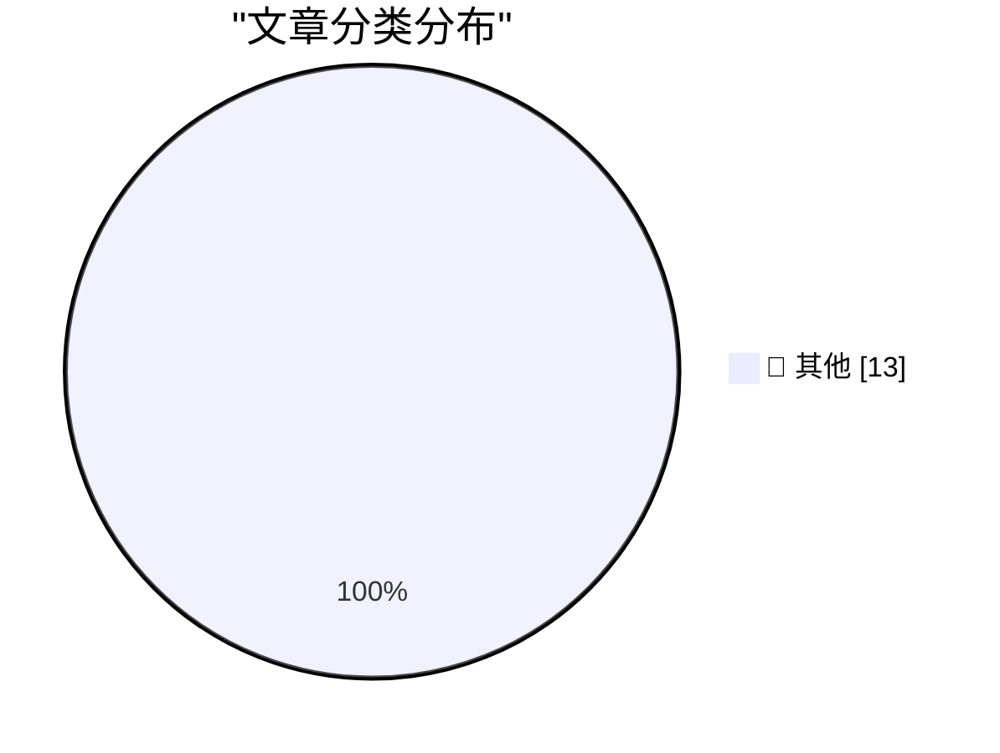

# 📰 AI 博客每日精选 — 2026-03-05

> 来自 Karpathy 推荐的 92 个顶级技术博客，AI 精选 Top 13

## 🏆 今日必读

🥇 **Anti-patterns: things to avoid**

[Anti-patterns: things to avoid](https://simonwillison.net/guides/agentic-engineering-patterns/anti-patterns/#atom-everything) — simonwillison.net · 10 小时前 · 📝 其他

> Anti-patterns: things to avoid

🥈 **Something is afoot in the land of Qwen**

[Something is afoot in the land of Qwen](https://simonwillison.net/2026/Mar/4/qwen/#atom-everything) — simonwillison.net · 12 小时前 · 📝 其他

> Something is afoot in the land of Qwen

🥉 **★ Thoughts and Observations on the MacBook Neo**

[★ Thoughts and Observations on the MacBook Neo](https://daringfireball.net/2026/03/599_not_a_piece_of_junk_macbook_neo) — daringfireball.net · 7 小时前 · 📝 其他

> ★ Thoughts and Observations on the MacBook Neo

---

## 📊 数据概览

| 扫描源 | 抓取文章 | 时间范围 | 精选 |
|:---:|:---:|:---:|:---:|
| 88/92 | 2501 篇 → 13 篇 | 24h | **13 篇** |

### 分类分布

---

## 📝 其他

### 1. Anti-patterns: things to avoid

[Anti-patterns: things to avoid](https://simonwillison.net/guides/agentic-engineering-patterns/anti-patterns/#atom-everything) — **simonwillison.net** · 10 小时前 · ⭐ 15/30

> Anti-patterns: things to avoid

---

### 2. Something is afoot in the land of Qwen

[Something is afoot in the land of Qwen](https://simonwillison.net/2026/Mar/4/qwen/#atom-everything) — **simonwillison.net** · 12 小时前 · ⭐ 15/30

> Something is afoot in the land of Qwen

---

### 3. ★ Thoughts and Observations on the MacBook Neo

[★ Thoughts and Observations on the MacBook Neo](https://daringfireball.net/2026/03/599_not_a_piece_of_junk_macbook_neo) — **daringfireball.net** · 7 小时前 · ⭐ 15/30

> ★ Thoughts and Observations on the MacBook Neo

---

### 4. Studio Display vs. Studio Display XDR

[Studio Display vs. Studio Display XDR](https://www.apple.com/displays/) — **daringfireball.net** · 9 小时前 · ⭐ 15/30

> Studio Display vs. Studio Display XDR

---

### 5. Compatibility Notes on the New Studio Displays

[Compatibility Notes on the New Studio Displays](https://www.macrumors.com/2026/03/03/apple-studio-display-no-intel-mac-support/) — **daringfireball.net** · 11 小时前 · ⭐ 15/30

> Compatibility Notes on the New Studio Displays

---

### 6. ‘In Other Words, Batman Has Become Superman and Robin Has Become Batman’

[‘In Other Words, Batman Has Become Superman and Robin Has Become Batman’](https://sixcolors.com/post/2026/03/apple-gives-in-to-temptation-and-renames-its-cpu-cores/) — **daringfireball.net** · 14 小时前 · ⭐ 15/30

> ‘In Other Words, Batman Has Become Superman and Robin Has Become Batman’

---

### 7. Interruption-Driven Development

[Interruption-Driven Development](https://idiallo.com/blog/interruption-driven-development?src=feed) — **idiallo.com** · 16 小时前 · ⭐ 15/30

> Interruption-Driven Development

---

### 8. How many hours do you need to work to afford a pint of beer?

[How many hours do you need to work to afford a pint of beer?](https://shkspr.mobi/blog/2026/03/how-many-hours-do-you-need-to-work-to-afford-a-pint-of-beer/) — **shkspr.mobi** · 15 小时前 · ⭐ 15/30

> How many hours do you need to work to afford a pint of beer?

---

### 9. Aha, I found a counterexample to the documentation that says that Query­Performance­Counter never fails

[Aha, I found a counterexample to the documentation that says that Query­Performance­Counter never fails](https://devblogs.microsoft.com/oldnewthing/20260304-00/?p=112110) — **devblogs.microsoft.com/oldnewthing** · 13 小时前 · ⭐ 15/30

> Aha, I found a counterexample to the documentation that says that Query­Performance­Counter never fails

---

### 10. From logistic regression to AI

[From logistic regression to AI](https://www.johndcook.com/blog/2026/03/04/from-logistic-regression-to-ai/) — **johndcook.com** · 13 小时前 · ⭐ 15/30

> From logistic regression to AI

---

### 11. An AI Odyssey, Part 2: Prompting Peril

[An AI Odyssey, Part 2: Prompting Peril](https://www.johndcook.com/blog/2026/03/04/an-ai-odyssey-part-2-prompting-peril/) — **johndcook.com** · 13 小时前 · ⭐ 15/30

> An AI Odyssey, Part 2: Prompting Peril

---

### 12. Package Managers Need to Cool Down

[Package Managers Need to Cool Down](https://nesbitt.io/2026/03/04/package-managers-need-to-cool-down.html) — **nesbitt.io** · 18 小时前 · ⭐ 15/30

> Package Managers Need to Cool Down

---

### 13. Homebrew Computer Club in Menlo Park

[Homebrew Computer Club in Menlo Park](https://dfarq.homeip.net/homebrew-computer-club-in-menlo-park/?utm_source=rss&#038;utm_medium=rss&#038;utm_campaign=homebrew-computer-club-in-menlo-park) — **dfarq.homeip.net** · 16 小时前 · ⭐ 15/30

> Homebrew Computer Club in Menlo Park

---

*生成于 2026-03-05 04:00 | 扫描 88 源 → 获取 2501 篇 → 精选 13 篇*
*基于 [Hacker News Popularity Contest 2025](https://refactoringenglish.com/tools/hn-popularity/) RSS 源列表，由 [Andrej Karpathy](https://x.com/karpathy) 推荐*
*由「懂点儿AI」制作，欢迎关注同名微信公众号获取更多 AI 实用技巧 💡*
