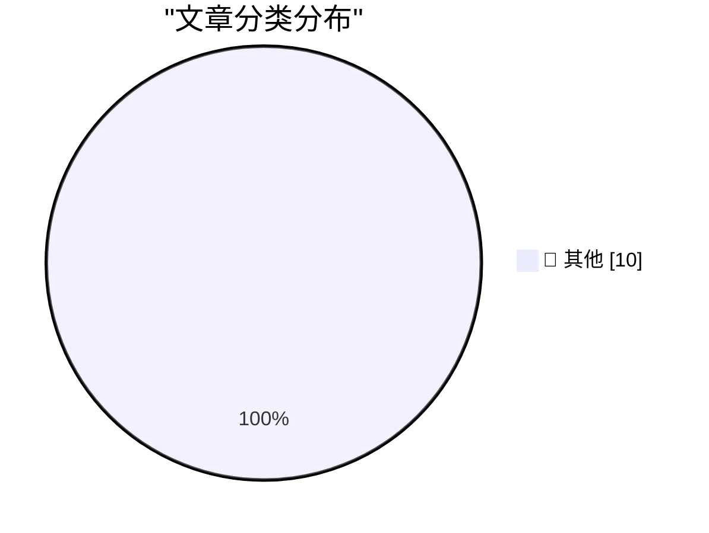

# 📰 AI 博客每日精选 — 2026-03-06

> 来自 Karpathy 推荐的 92 个顶级技术博客，AI 精选 Top 10

## 🏆 今日必读

🥇 **Clinejection — Compromising Cline's Production Releases just by Prompting an Issue Triager**

[Clinejection — Compromising Cline's Production Releases just by Prompting an Issue Triager](https://simonwillison.net/2026/Mar/6/clinejection/#atom-everything) — simonwillison.net · 1 小时前 · 📝 其他

> Clinejection — Compromising Cline's Production Releases just by Prompting an Issue Triager

🥈 **Introducing GPT‑5.4**

[Introducing GPT‑5.4](https://simonwillison.net/2026/Mar/5/introducing-gpt54/#atom-everything) — simonwillison.net · 4 小时前 · 📝 其他

> Introducing GPT‑5.4

🥉 **Can coding agents relicense open source through a “clean room” implementation of code?**

[Can coding agents relicense open source through a “clean room” implementation of code?](https://simonwillison.net/2026/Mar/5/chardet/#atom-everything) — simonwillison.net · 11 小时前 · 📝 其他

> Can coding agents relicense open source through a “clean room” implementation of code?

---

## 📊 数据概览

| 扫描源 | 抓取文章 | 时间范围 | 精选 |
|:---:|:---:|:---:|:---:|
| 88/92 | 2501 篇 → 10 篇 | 24h | **10 篇** |

### 分类分布

---

## 📝 其他

### 1. Clinejection — Compromising Cline's Production Releases just by Prompting an Issue Triager

[Clinejection — Compromising Cline's Production Releases just by Prompting an Issue Triager](https://simonwillison.net/2026/Mar/6/clinejection/#atom-everything) — **simonwillison.net** · 1 小时前 · ⭐ 15/30

> Clinejection — Compromising Cline's Production Releases just by Prompting an Issue Triager

---

### 2. Introducing GPT‑5.4

[Introducing GPT‑5.4](https://simonwillison.net/2026/Mar/5/introducing-gpt54/#atom-everything) — **simonwillison.net** · 4 小时前 · ⭐ 15/30

> Introducing GPT‑5.4

---

### 3. Can coding agents relicense open source through a “clean room” implementation of code?

[Can coding agents relicense open source through a “clean room” implementation of code?](https://simonwillison.net/2026/Mar/5/chardet/#atom-everything) — **simonwillison.net** · 11 小时前 · ⭐ 15/30

> Can coding agents relicense open source through a “clean room” implementation of code?

---

### 4. Steve Jobs in 2007, on Apple’s Pursuit of PC Market Share: ‘We Just Can’t Ship Junk’

[Steve Jobs in 2007, on Apple’s Pursuit of PC Market Share: ‘We Just Can’t Ship Junk’](https://www.youtube.com/watch?v=U37Ds3RvyoM) — **daringfireball.net** · 8 小时前 · ⭐ 15/30

> Steve Jobs in 2007, on Apple’s Pursuit of PC Market Share: ‘We Just Can’t Ship Junk’

---

### 5. Pluralistic: Blowtorching the frog (05 Mar 2026) executive-dysfunction

[Pluralistic: Blowtorching the frog (05 Mar 2026) executive-dysfunction](https://pluralistic.net/2026/03/05/executive-dysfunction/) — **pluralistic.net** · 8 小时前 · ⭐ 15/30

> Pluralistic: Blowtorching the frog (05 Mar 2026) executive-dysfunction

---

### 6. Book Review: Katabasis by R. F. Kuang ★★★★⯪

[Book Review: Katabasis by R. F. Kuang ★★★★⯪](https://shkspr.mobi/blog/2026/03/book-review-katabasis-by-r-f-kuang/) — **shkspr.mobi** · 15 小时前 · ⭐ 15/30

> Book Review: Katabasis by R. F. Kuang ★★★★⯪

---

### 7. The mystery of the posted message that was dispatched before reaching the main message loop

[The mystery of the posted message that was dispatched before reaching the main message loop](https://devblogs.microsoft.com/oldnewthing/20260305-00/?p=112114) — **devblogs.microsoft.com/oldnewthing** · 13 小时前 · ⭐ 15/30

> The mystery of the posted message that was dispatched before reaching the main message loop

---

### 8. Don’t trust Generative AI to do your taxes — and don’t trust it with people’s lives

[Don’t trust Generative AI to do your taxes — and don’t trust it with people’s lives](https://garymarcus.substack.com/p/dont-trust-generative-ai-to-do-your) — **garymarcus.substack.com** · 10 小时前 · ⭐ 15/30

> Don’t trust Generative AI to do your taxes — and don’t trust it with people’s lives

---

### 9. Package Manager Magic Files

[Package Manager Magic Files](https://nesbitt.io/2026/03/05/package-manager-magic-files.html) — **nesbitt.io** · 18 小时前 · ⭐ 15/30

> Package Manager Magic Files

---

### 10. Remembering the Michelangelo virus

[Remembering the Michelangelo virus](https://dfarq.homeip.net/remembering-michelangelo/?utm_source=rss&#038;utm_medium=rss&#038;utm_campaign=remembering-michelangelo) — **dfarq.homeip.net** · 16 小时前 · ⭐ 15/30

> Remembering the Michelangelo virus

---

*生成于 2026-03-06 04:00 | 扫描 88 源 → 获取 2501 篇 → 精选 10 篇*
*基于 [Hacker News Popularity Contest 2025](https://refactoringenglish.com/tools/hn-popularity/) RSS 源列表，由 [Andrej Karpathy](https://x.com/karpathy) 推荐*
*由「懂点儿AI」制作，欢迎关注同名微信公众号获取更多 AI 实用技巧 💡*
