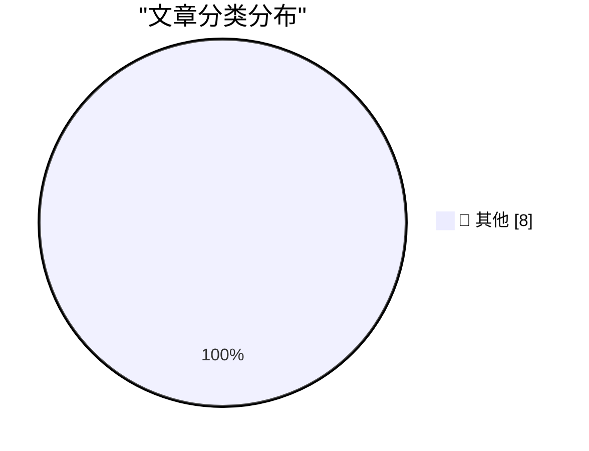

# 📰 AI 博客每日精选 — 2026-03-08

> 来自 Karpathy 推荐的 92 个顶级技术博客，AI 精选 Top 8

## 🏆 今日必读

🥇 **Codex for Open Source**

[Codex for Open Source](https://simonwillison.net/2026/Mar/7/codex-for-open-source/#atom-everything) — simonwillison.net · 9 小时前 · 📝 其他

> Codex for Open Source

🥈 **‘npx workos’**

[‘npx workos’](https://workos.com/docs/authkit/cli-installer?utm_source=tldrdev&amp;utm_medium=newsletter&amp;utm_campaign=q12026) — daringfireball.net · 5 小时前 · 📝 其他

> ‘npx workos’

🥉 **Pluralistic: The web is bearable with RSS (07 Mar 2026)**

[Pluralistic: The web is bearable with RSS (07 Mar 2026)](https://pluralistic.net/2026/03/07/reader-mode/) — pluralistic.net · 9 小时前 · 📝 其他

> Pluralistic: The web is bearable with RSS (07 Mar 2026)

---

## 📊 数据概览

| 扫描源 | 抓取文章 | 时间范围 | 精选 |
|:---:|:---:|:---:|:---:|
| 87/92 | 2479 篇 → 8 篇 | 24h | **8 篇** |

### 分类分布

---

## 📝 其他

### 1. Codex for Open Source

[Codex for Open Source](https://simonwillison.net/2026/Mar/7/codex-for-open-source/#atom-everything) — **simonwillison.net** · 9 小时前 · ⭐ 15/30

> Codex for Open Source

---

### 2. ‘npx workos’

[‘npx workos’](https://workos.com/docs/authkit/cli-installer?utm_source=tldrdev&amp;utm_medium=newsletter&amp;utm_campaign=q12026) — **daringfireball.net** · 5 小时前 · ⭐ 15/30

> ‘npx workos’

---

### 3. Pluralistic: The web is bearable with RSS (07 Mar 2026)

[Pluralistic: The web is bearable with RSS (07 Mar 2026)](https://pluralistic.net/2026/03/07/reader-mode/) — **pluralistic.net** · 9 小时前 · ⭐ 15/30

> Pluralistic: The web is bearable with RSS (07 Mar 2026)

---

### 4. Book Review: The Electronic Criminals by Robert Farr (1975) ★★★⯪☆

[Book Review: The Electronic Criminals by Robert Farr (1975) ★★★⯪☆](https://shkspr.mobi/blog/2026/03/book-review-the-electronic-criminals-by-robert-farr-1975/) — **shkspr.mobi** · 15 小时前 · ⭐ 15/30

> Book Review: The Electronic Criminals by Robert Farr (1975) ★★★⯪☆

---

### 5. BREAKING: Sam Altman’s greed and dishonesty are finally catching up to him

[BREAKING: Sam Altman’s greed and dishonesty are finally catching up to him](https://garymarcus.substack.com/p/breaking-sam-altmans-greed-and-dishonesty) — **garymarcus.substack.com** · 9 小时前 · ⭐ 15/30

> BREAKING: Sam Altman’s greed and dishonesty are finally catching up to him

---

### 6. Announcing New Working Groups

[Announcing New Working Groups](https://nesbitt.io/2026/03/07/announcing-new-working-groups.html) — **nesbitt.io** · 18 小时前 · ⭐ 15/30

> Announcing New Working Groups

---

### 7. Reading List 03/07/2026

[Reading List 03/07/2026](https://www.construction-physics.com/p/reading-list-03072026) — **construction-physics.com** · 14 小时前 · ⭐ 15/30

> Reading List 03/07/2026

---

### 8. The Ghost in the Funnel

[The Ghost in the Funnel](https://worksonmymachine.ai/p/the-ghost-in-the-funnel) — **worksonmymachine.substack.com** · 13 小时前 · ⭐ 15/30

> The Ghost in the Funnel

---

*生成于 2026-03-08 04:00 | 扫描 87 源 → 获取 2479 篇 → 精选 8 篇*
*基于 [Hacker News Popularity Contest 2025](https://refactoringenglish.com/tools/hn-popularity/) RSS 源列表，由 [Andrej Karpathy](https://x.com/karpathy) 推荐*
*由「懂点儿AI」制作，欢迎关注同名微信公众号获取更多 AI 实用技巧 💡*
