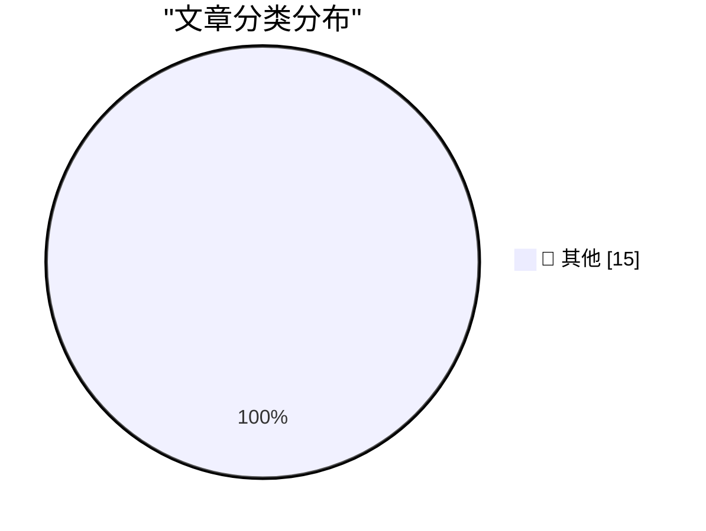

# 📰 AI 博客每日精选 — 2026-03-11

> 来自 Karpathy 推荐的 92 个顶级技术博客，AI 精选 Top 15

## 🏆 今日必读

🥇 **AI should help us produce better code**

[AI should help us produce better code](https://simonwillison.net/guides/agentic-engineering-patterns/better-code/#atom-everything) — simonwillison.net · 5 小时前 · 📝 其他

> AI should help us produce better code

🥈 **Microsoft Patch Tuesday, March 2026 Edition**

[Microsoft Patch Tuesday, March 2026 Edition](https://krebsonsecurity.com/2026/03/microsoft-patch-tuesday-march-2026-edition/) — krebsonsecurity.com · 3 小时前 · 📝 其他

> Microsoft Patch Tuesday, March 2026 Edition

🥉 **★ The MacBook Neo**

[★ The MacBook Neo](https://daringfireball.net/2026/03/the_macbook_neo) — daringfireball.net · 5 小时前 · 📝 其他

> ★ The MacBook Neo

---

## 📊 数据概览

| 扫描源 | 抓取文章 | 时间范围 | 精选 |
|:---:|:---:|:---:|:---:|
| 87/92 | 2481 篇 → 17 篇 | 24h | **15 篇** |

### 分类分布

---

## 📝 其他

### 1. AI should help us produce better code

[AI should help us produce better code](https://simonwillison.net/guides/agentic-engineering-patterns/better-code/#atom-everything) — **simonwillison.net** · 5 小时前 · ⭐ 15/30

> AI should help us produce better code

---

### 2. Microsoft Patch Tuesday, March 2026 Edition

[Microsoft Patch Tuesday, March 2026 Edition](https://krebsonsecurity.com/2026/03/microsoft-patch-tuesday-march-2026-edition/) — **krebsonsecurity.com** · 3 小时前 · ⭐ 15/30

> Microsoft Patch Tuesday, March 2026 Edition

---

### 3. ★ The MacBook Neo

[★ The MacBook Neo](https://daringfireball.net/2026/03/the_macbook_neo) — **daringfireball.net** · 5 小时前 · ⭐ 15/30

> ★ The MacBook Neo

---

### 4. The Server Older than my Kids!

[The Server Older than my Kids!](https://idiallo.com/byte-size/my-server-is-older-than-my-kids?src=feed) — **idiallo.com** · 2 小时前 · ⭐ 15/30

> The Server Older than my Kids!

---

### 5. I'm Not Lying, I'm Hallucinating

[I'm Not Lying, I'm Hallucinating](https://idiallo.com/byte-size/im-not-lying-im-hallucinating?src=feed) — **idiallo.com** · 7 小时前 · ⭐ 15/30

> I'm Not Lying, I'm Hallucinating

---

### 6. Pluralistic: Ad-tech is fascist tech (10 Mar 2026)

[Pluralistic: Ad-tech is fascist tech (10 Mar 2026)](https://pluralistic.net/2026/03/10/ice-tech/) — **pluralistic.net** · 12 小时前 · ⭐ 15/30

> Pluralistic: Ad-tech is fascist tech (10 Mar 2026)

---

### 7. Unstructured Data and the Joy of having Something Else think for you

[Unstructured Data and the Joy of having Something Else think for you](https://shkspr.mobi/blog/2026/03/unstructured-data-and-the-joy-of-having-something-else-think-for-you/) — **shkspr.mobi** · 15 小时前 · ⭐ 15/30

> Unstructured Data and the Joy of having Something Else think for you

---

### 8. A snappy answer when asked about dressing casually at IBM

[A snappy answer when asked about dressing casually at IBM](https://devblogs.microsoft.com/oldnewthing/20260310-00/?p=112131) — **devblogs.microsoft.com/oldnewthing** · 14 小时前 · ⭐ 15/30

> A snappy answer when asked about dressing casually at IBM

---

### 9. “A spate of outages, including incidents tied to the use of AI coding tools”, right on schedule

[“A spate of outages, including incidents tied to the use of AI coding tools”, right on schedule](https://garymarcus.substack.com/p/a-spate-of-outages-including-incidents) — **garymarcus.substack.com** · 12 小时前 · ⭐ 15/30

> “A spate of outages, including incidents tied to the use of AI coding tools”, right on schedule

---

### 10. Simplifying expressions in SymPy

[Simplifying expressions in SymPy](https://www.johndcook.com/blog/2026/03/10/simplifying-expressions-in-sympy/) — **johndcook.com** · 11 小时前 · ⭐ 15/30

> Simplifying expressions in SymPy

---

### 11. sinh( arccosh(x) )

[sinh( arccosh(x) )](https://www.johndcook.com/blog/2026/03/10/sinh-arccosh/) — **johndcook.com** · 12 小时前 · ⭐ 15/30

> sinh( arccosh(x) )

---

### 12. Writing an LLM from scratch, part 32e -- Interventions: the learning rate

[Writing an LLM from scratch, part 32e -- Interventions: the learning rate](https://www.gilesthomas.com/2026/03/llm-from-scratch-32e-interventions-learning-rate) — **gilesthomas.com** · 4 小时前 · ⭐ 15/30

> Writing an LLM from scratch, part 32e -- Interventions: the learning rate

---

### 13. Just Use Postgres

[Just Use Postgres](https://nesbitt.io/2026/03/10/just-use-postgres.html) — **nesbitt.io** · 18 小时前 · ⭐ 15/30

> Just Use Postgres

---

### 14. LLMs are bad at vibing specifications

[LLMs are bad at vibing specifications](https://buttondown.com/hillelwayne/archive/llms-are-bad-at-vibing-specifications/) — **buttondown.com/hillelwayne** · 10 小时前 · ⭐ 15/30

> LLMs are bad at vibing specifications

---

### 15. The Beginning Of History

[The Beginning Of History](https://www.wheresyoured.at/the-beginning-of-history/) — **wheresyoured.at** · 9 小时前 · ⭐ 15/30

> The Beginning Of History

---

*生成于 2026-03-11 04:01 | 扫描 87 源 → 获取 2481 篇 → 精选 15 篇*
*基于 [Hacker News Popularity Contest 2025](https://refactoringenglish.com/tools/hn-popularity/) RSS 源列表，由 [Andrej Karpathy](https://x.com/karpathy) 推荐*
*由「懂点儿AI」制作，欢迎关注同名微信公众号获取更多 AI 实用技巧 💡*
