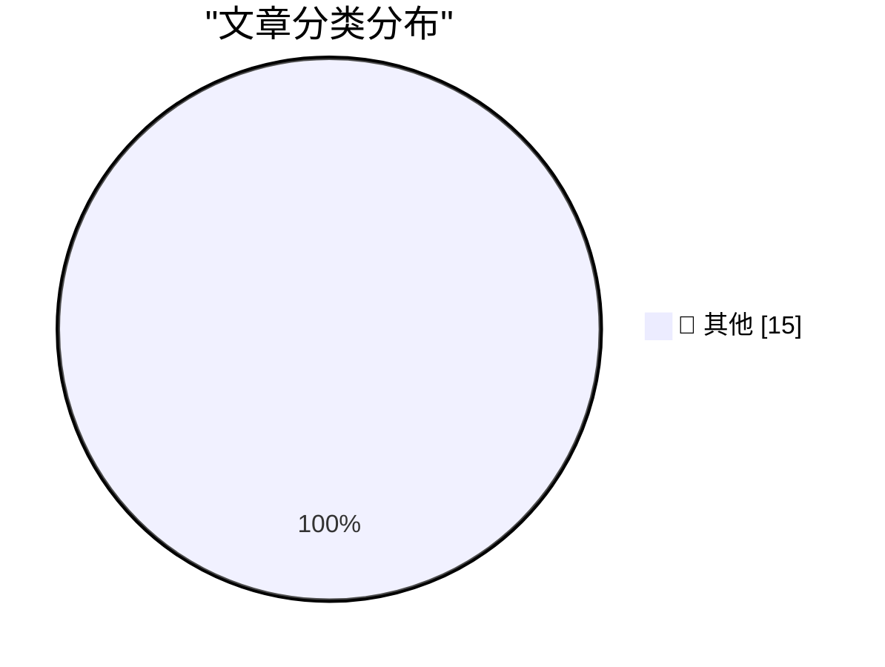

# 📰 AI 博客每日精选 — 2026-03-16

> 来自 Karpathy 推荐的 92 个顶级技术博客，AI 精选 Top 15

## 🏆 今日必读

🥇 **What is agentic engineering?**

[What is agentic engineering?](https://simonwillison.net/guides/agentic-engineering-patterns/what-is-agentic-engineering/#atom-everything) — simonwillison.net · 5 小时前 · 📝 其他

> What is agentic engineering?

🥈 **CHM Live: Apple at 50**

[CHM Live: Apple at 50](https://www.youtube.com/live/eCSNJgI2LFI) — daringfireball.net · 5 小时前 · 📝 其他

> CHM Live: Apple at 50

🥉 **Finalist 3.6**

[Finalist 3.6](https://www.finalist.works/finalist-36/) — daringfireball.net · 10 小时前 · 📝 其他

> Finalist 3.6

---

## 📊 数据概览

| 扫描源 | 抓取文章 | 时间范围 | 精选 |
|:---:|:---:|:---:|:---:|
| 88/92 | 2512 篇 → 15 篇 | 24h | **15 篇** |

### 分类分布

---

## 📝 其他

### 1. What is agentic engineering?

[What is agentic engineering?](https://simonwillison.net/guides/agentic-engineering-patterns/what-is-agentic-engineering/#atom-everything) — **simonwillison.net** · 5 小时前 · ⭐ 15/30

> What is agentic engineering?

---

### 2. CHM Live: Apple at 50

[CHM Live: Apple at 50](https://www.youtube.com/live/eCSNJgI2LFI) — **daringfireball.net** · 5 小时前 · ⭐ 15/30

> CHM Live: Apple at 50

---

### 3. Finalist 3.6

[Finalist 3.6](https://www.finalist.works/finalist-36/) — **daringfireball.net** · 10 小时前 · ⭐ 15/30

> Finalist 3.6

---

### 4. ‘This Is Not the Computer for You’

[‘This Is Not the Computer for You’](https://samhenri.gold/blog/20260312-this-is-not-the-computer-for-you/?ref=birchtree.me) — **daringfireball.net** · 10 小时前 · ⭐ 15/30

> ‘This Is Not the Computer for You’

---

### 5. Blaming AI for Layoffs: ‘It Plays Better’

[Blaming AI for Layoffs: ‘It Plays Better’](https://www.resume.org/the-great-turnover-9-in-10-companies-plan-to-hire-in-2026-yet-6-in-10-will-have-layoffs-2/) — **daringfireball.net** · 11 小时前 · ⭐ 15/30

> Blaming AI for Layoffs: ‘It Plays Better’

---

### 6. Horace Dediu on Apple Sitting Out the AI Spending Race

[Horace Dediu on Apple Sitting Out the AI Spending Race](https://asymco.com/2026/03/10/the-most-brilliant-move-in-corporate-history/) — **daringfireball.net** · 12 小时前 · ⭐ 15/30

> Horace Dediu on Apple Sitting Out the AI Spending Race

---

### 7. Reuters: ‘Meta Planning Sweeping Layoffs as AI Costs Mount’

[Reuters: ‘Meta Planning Sweeping Layoffs as AI Costs Mount’](https://www.reuters.com/business/world-at-work/meta-planning-sweeping-layoffs-ai-costs-mount-2026-03-14/) — **daringfireball.net** · 12 小时前 · ⭐ 15/30

> Reuters: ‘Meta Planning Sweeping Layoffs as AI Costs Mount’

---

### 8. Shower Thought: Git Teleportation

[Shower Thought: Git Teleportation](https://idiallo.com/byte-size/git-teleportation?src=feed) — **idiallo.com** · 3 小时前 · ⭐ 15/30

> Shower Thought: Git Teleportation

---

### 9. Book Review: Robots in Space - The Secret Lives of Our Planetary Explorers by Dr Ezzy Pearson ★★★⯪☆

[Book Review: Robots in Space - The Secret Lives of Our Planetary Explorers by Dr Ezzy Pearson ★★★⯪☆](https://shkspr.mobi/blog/2026/03/book-review-robots-in-space-the-secret-lives-of-our-planetary-explorers-by-dr-ezzy-pearson/) — **shkspr.mobi** · 15 小时前 · ⭐ 15/30

> Book Review: Robots in Space - The Secret Lives of Our Planetary Explorers by Dr Ezzy Pearson ★★★⯪☆

---

### 10. BREAKING: Sam Altman concedes that we need major breakthroughs beyond mere scaling to get to AGI

[BREAKING: Sam Altman concedes that we need major breakthroughs beyond mere scaling to get to AGI](https://garymarcus.substack.com/p/breaking-sam-altman-concedes-that) — **garymarcus.substack.com** · 2 小时前 · ⭐ 15/30

> BREAKING: Sam Altman concedes that we need major breakthroughs beyond mere scaling to get to AGI

---

### 11. Twelve-tone composition

[Twelve-tone composition](https://www.johndcook.com/blog/2026/03/15/twelve-tone-composition/) — **johndcook.com** · 4 小时前 · ⭐ 15/30

> Twelve-tone composition

---

### 12. Langford series

[Langford series](https://www.johndcook.com/blog/2026/03/15/langford-series/) — **johndcook.com** · 8 小时前 · ⭐ 15/30

> Langford series

---

### 13. The optimized self and the life that got away

[The optimized self and the life that got away](https://www.joanwestenberg.com/the-optimized-self-and-the-life-that-got-away/) — **joanwestenberg.com** · 5 小时前 · ⭐ 15/30

> The optimized self and the life that got away

---

### 14. Guided Meditation for Developers

[Guided Meditation for Developers](https://nesbitt.io/2026/03/15/guided-meditation-for-developers.html) — **nesbitt.io** · 18 小时前 · ⭐ 15/30

> Guided Meditation for Developers

---

### 15. BertVote Gemeenteraadsverkiezingen 2026

[BertVote Gemeenteraadsverkiezingen 2026](https://berthub.eu/articles/posts/bert-vote-gemeenteraad-2026/) — **berthub.eu** · 16 小时前 · ⭐ 15/30

> BertVote Gemeenteraadsverkiezingen 2026

---

*生成于 2026-03-16 04:00 | 扫描 88 源 → 获取 2512 篇 → 精选 15 篇*
*基于 [Hacker News Popularity Contest 2025](https://refactoringenglish.com/tools/hn-popularity/) RSS 源列表，由 [Andrej Karpathy](https://x.com/karpathy) 推荐*
*由「懂点儿AI」制作，欢迎关注同名微信公众号获取更多 AI 实用技巧 💡*
