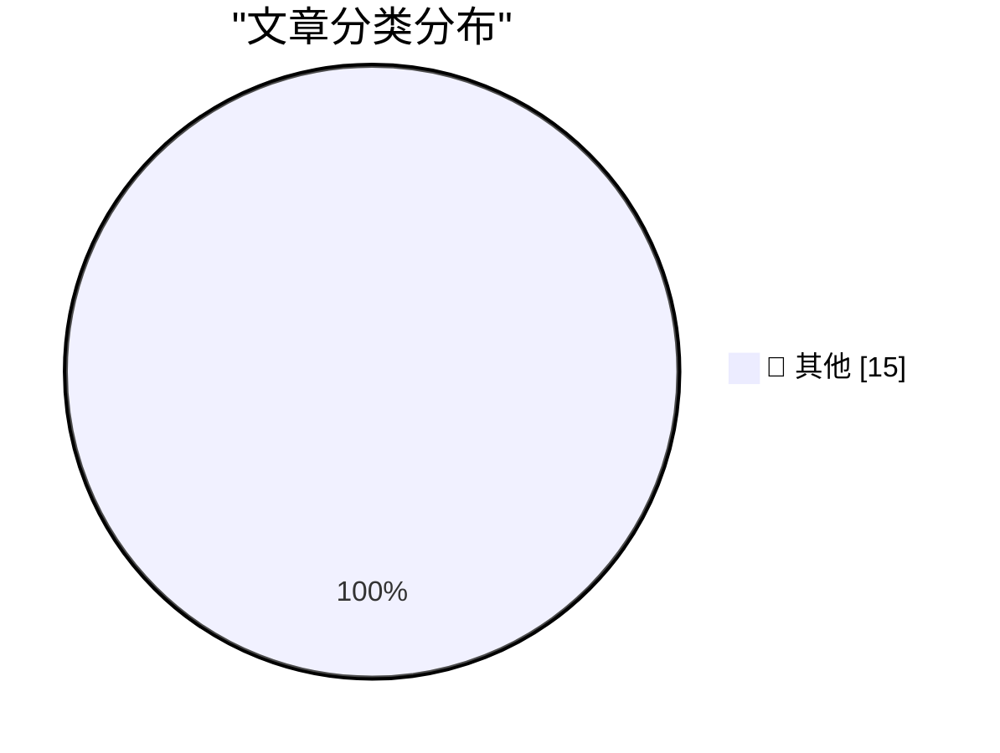

# 📰 AI 博客每日精选 — 2026-03-20

> 来自 Karpathy 推荐的 92 个顶级技术博客，AI 精选 Top 15

## 🏆 今日必读

🥇 **Thoughts on OpenAI acquiring Astral and uv/ruff/ty**

[Thoughts on OpenAI acquiring Astral and uv/ruff/ty](https://simonwillison.net/2026/Mar/19/openai-acquiring-astral/#atom-everything) — simonwillison.net · 11 小时前 · 📝 其他

> Thoughts on OpenAI acquiring Astral and uv/ruff/ty

🥈 **Feds Disrupt IoT Botnets Behind Huge DDoS Attacks**

[Feds Disrupt IoT Botnets Behind Huge DDoS Attacks](https://krebsonsecurity.com/2026/03/feds-disrupt-iot-botnets-behind-huge-ddos-attacks/) — krebsonsecurity.com · 3 小时前 · 📝 其他

> Feds Disrupt IoT Botnets Behind Huge DDoS Attacks

🥉 **StopTheMadness Pro and StopTheScript Extensions for Safari**

[StopTheMadness Pro and StopTheScript Extensions for Safari](https://mastodon.social/@lapcatsoftware/116252960395480568) — daringfireball.net · 6 小时前 · 📝 其他

> StopTheMadness Pro and StopTheScript Extensions for Safari

---

## 📊 数据概览

| 扫描源 | 抓取文章 | 时间范围 | 精选 |
|:---:|:---:|:---:|:---:|
| 88/92 | 2515 篇 → 17 篇 | 24h | **15 篇** |

### 分类分布

---

## 📝 其他

### 1. Thoughts on OpenAI acquiring Astral and uv/ruff/ty

[Thoughts on OpenAI acquiring Astral and uv/ruff/ty](https://simonwillison.net/2026/Mar/19/openai-acquiring-astral/#atom-everything) — **simonwillison.net** · 11 小时前 · ⭐ 15/30

> Thoughts on OpenAI acquiring Astral and uv/ruff/ty

---

### 2. Feds Disrupt IoT Botnets Behind Huge DDoS Attacks

[Feds Disrupt IoT Botnets Behind Huge DDoS Attacks](https://krebsonsecurity.com/2026/03/feds-disrupt-iot-botnets-behind-huge-ddos-attacks/) — **krebsonsecurity.com** · 3 小时前 · ⭐ 15/30

> Feds Disrupt IoT Botnets Behind Huge DDoS Attacks

---

### 3. StopTheMadness Pro and StopTheScript Extensions for Safari

[StopTheMadness Pro and StopTheScript Extensions for Safari](https://mastodon.social/@lapcatsoftware/116252960395480568) — **daringfireball.net** · 6 小时前 · ⭐ 15/30

> StopTheMadness Pro and StopTheScript Extensions for Safari

---

### 4. Actual Headline in the Actual New York Times: ‘Trump Jokes About Pearl Harbor in Meeting With Japan’s Leader’

[Actual Headline in the Actual New York Times: ‘Trump Jokes About Pearl Harbor in Meeting With Japan’s Leader’](https://www.nytimes.com/2026/03/19/us/politics/trump-japan-pearl-harbor-oval-office-takaichi.html?unlocked_article_code=1.UVA.zau0.UZ5WnBjtPHot) — **daringfireball.net** · 6 小时前 · ⭐ 15/30

> Actual Headline in the Actual New York Times: ‘Trump Jokes About Pearl Harbor in Meeting With Japan’s Leader’

---

### 5. ‘Everyone but Trump Understands What He’s Done’

[‘Everyone but Trump Understands What He’s Done’](https://www.theatlantic.com/ideas/2026/03/trump-iran-war-allies/686423/?gift=aQyUJR7AIw1mJWdQ6Ed6yGfvOucd9Oa8W54yMDTtr2I) — **daringfireball.net** · 7 小时前 · ⭐ 15/30

> ‘Everyone but Trump Understands What He’s Done’

---

### 6. The Day Mark Simonson Discovered Type Design

[The Day Mark Simonson Discovered Type Design](https://www.marksimonson.com/notebook/view/the-day-i-discovered-type-design/) — **daringfireball.net** · 8 小时前 · ⭐ 15/30

> The Day Mark Simonson Discovered Type Design

---

### 7. Google’s New Sideloading Restrictions for Android Include a 24-Hour Waiting Period

[Google’s New Sideloading Restrictions for Android Include a 24-Hour Waiting Period](https://www.androidauthority.com/google-android-sideloading-unverified-apps-new-rules-3650343/) — **daringfireball.net** · 8 小时前 · ⭐ 15/30

> Google’s New Sideloading Restrictions for Android Include a 24-Hour Waiting Period

---

### 8. Hacker News Discussion on Shubham Bose’s ‘The 49MB Web Page’

[Hacker News Discussion on Shubham Bose’s ‘The 49MB Web Page’](https://news.ycombinator.com/item?id=47390945) — **daringfireball.net** · 10 小时前 · ⭐ 15/30

> Hacker News Discussion on Shubham Bose’s ‘The 49MB Web Page’

---

### 9. ★ AppleScript: ‘Save MarsEdit Document to Text File’

[★ AppleScript: ‘Save MarsEdit Document to Text File’](https://daringfireball.net/2026/03/applescript_save_marsedit_document_to_text_file) — **daringfireball.net** · 11 小时前 · ⭐ 15/30

> ★ AppleScript: ‘Save MarsEdit Document to Text File’

---

### 10. Pluralistic: Love of corporate bullshit is correlated with bad judgment (19 Mar 2026)

[Pluralistic: Love of corporate bullshit is correlated with bad judgment (19 Mar 2026)](https://pluralistic.net/2026/03/19/jargon-watch/) — **pluralistic.net** · 15 小时前 · ⭐ 15/30

> Pluralistic: Love of corporate bullshit is correlated with bad judgment (19 Mar 2026)

---

### 11. Windows stack limit checking retrospective: amd64, also known as x86-64

[Windows stack limit checking retrospective: amd64, also known as x86-64](https://devblogs.microsoft.com/oldnewthing/20260319-00/?p=112152) — **devblogs.microsoft.com/oldnewthing** · 14 小时前 · ⭐ 15/30

> Windows stack limit checking retrospective: amd64, also known as x86-64

---

### 12. Members Only: How do we define our own flourishing?

[Members Only: How do we define our own flourishing?](https://www.joanwestenberg.com/members-only-how-do-we-define-our-own-flourishing/) — **joanwestenberg.com** · 3 小时前 · ⭐ 15/30

> Members Only: How do we define our own flourishing?

---

### 13. The Fragmented World of Dependency Policy

[The Fragmented World of Dependency Policy](https://nesbitt.io/2026/03/19/the-fragmented-world-of-dependency-policy.html) — **nesbitt.io** · 18 小时前 · ⭐ 15/30

> The Fragmented World of Dependency Policy

---

### 14. How Much Computing Power is in a Data Center?

[How Much Computing Power is in a Data Center?](https://www.construction-physics.com/p/how-much-computing-power-is-in-a) — **construction-physics.com** · 15 小时前 · ⭐ 15/30

> How Much Computing Power is in a Data Center?

---

### 15. Magnavox Odyssey 2: 1978-1984

[Magnavox Odyssey 2: 1978-1984](https://dfarq.homeip.net/magnavox-odyssey-2-overlooked-game-console/?utm_source=rss&#038;utm_medium=rss&#038;utm_campaign=magnavox-odyssey-2-overlooked-game-console) — **dfarq.homeip.net** · 17 小时前 · ⭐ 15/30

> Magnavox Odyssey 2: 1978-1984

---

*生成于 2026-03-20 04:01 | 扫描 88 源 → 获取 2515 篇 → 精选 15 篇*
*基于 [Hacker News Popularity Contest 2025](https://refactoringenglish.com/tools/hn-popularity/) RSS 源列表，由 [Andrej Karpathy](https://x.com/karpathy) 推荐*
*由「懂点儿AI」制作，欢迎关注同名微信公众号获取更多 AI 实用技巧 💡*
