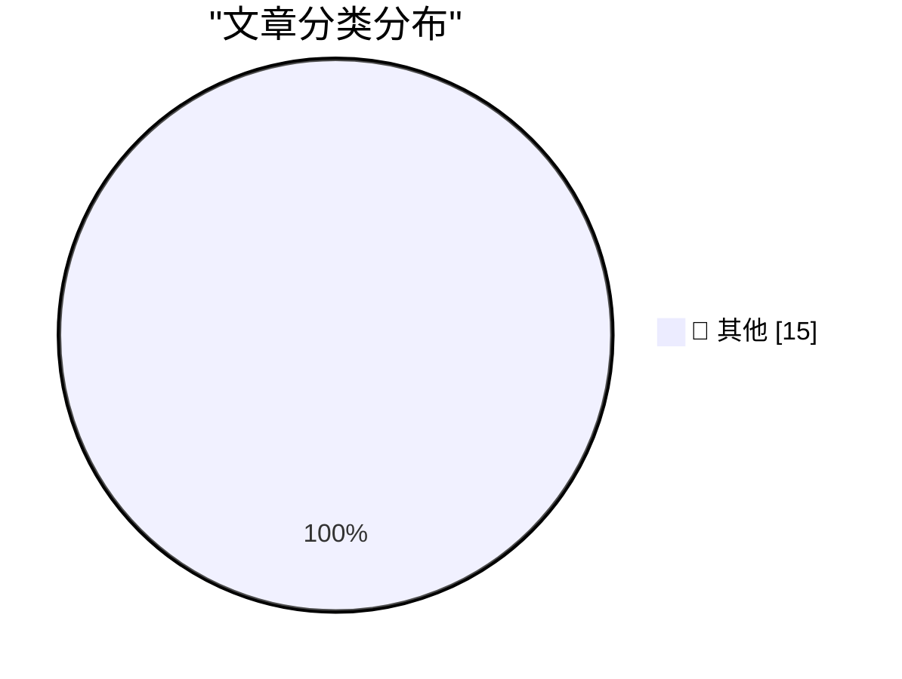

# 📰 AI 博客每日精选 — 2026-03-23

> 来自 Karpathy 推荐的 92 个顶级技术博客，AI 精选 Top 15

## 🏆 今日必读

🥇 **Beats now have notes**

[Beats now have notes](https://simonwillison.net/2026/Mar/23/beats-now-have-notes/#atom-everything) — simonwillison.net · 1 小时前 · 📝 其他

> Beats now have notes

🥈 **Starlette 1.0 skill**

[Starlette 1.0 skill](https://simonwillison.net/2026/Mar/23/starlette-1-skill/#atom-everything) — simonwillison.net · 3 小时前 · 📝 其他

> Starlette 1.0 skill

🥉 **Experimenting with Starlette 1.0 with Claude skills**

[Experimenting with Starlette 1.0 with Claude skills](https://simonwillison.net/2026/Mar/22/starlette/#atom-everything) — simonwillison.net · 4 小时前 · 📝 其他

> Experimenting with Starlette 1.0 with Claude skills

---

## 📊 数据概览

| 扫描源 | 抓取文章 | 时间范围 | 精选 |
|:---:|:---:|:---:|:---:|
| 88/92 | 2516 篇 → 15 篇 | 24h | **15 篇** |

### 分类分布

---

## 📝 其他

### 1. Beats now have notes

[Beats now have notes](https://simonwillison.net/2026/Mar/23/beats-now-have-notes/#atom-everything) — **simonwillison.net** · 1 小时前 · ⭐ 15/30

> Beats now have notes

---

### 2. Starlette 1.0 skill

[Starlette 1.0 skill](https://simonwillison.net/2026/Mar/23/starlette-1-skill/#atom-everything) — **simonwillison.net** · 3 小时前 · ⭐ 15/30

> Starlette 1.0 skill

---

### 3. Experimenting with Starlette 1.0 with Claude skills

[Experimenting with Starlette 1.0 with Claude skills](https://simonwillison.net/2026/Mar/22/starlette/#atom-everything) — **simonwillison.net** · 4 小时前 · ⭐ 15/30

> Experimenting with Starlette 1.0 with Claude skills

---

### 4. PCGamer Article Performance Audit

[PCGamer Article Performance Audit](https://simonwillison.net/2026/Mar/22/pcgamer-audit/#atom-everything) — **simonwillison.net** · 5 小时前 · ⭐ 15/30

> PCGamer Article Performance Audit

---

### 5. JavaScript Sandboxing Research

[JavaScript Sandboxing Research](https://simonwillison.net/2026/Mar/22/javascript-sandboxing-research/#atom-everything) — **simonwillison.net** · 8 小时前 · ⭐ 15/30

> JavaScript Sandboxing Research

---

### 6. DNS Lookup

[DNS Lookup](https://simonwillison.net/2026/Mar/22/dns/#atom-everything) — **simonwillison.net** · 8 小时前 · ⭐ 15/30

> DNS Lookup

---

### 7. Merge State Visualizer

[Merge State Visualizer](https://simonwillison.net/2026/Mar/22/manyana/#atom-everything) — **simonwillison.net** · 9 小时前 · ⭐ 15/30

> Merge State Visualizer

---

### 8. Mux — Video API for Developers

[Mux — Video API for Developers](https://www.mux.com/?utm_campaign=fireball&amp;utm_source=DF) — **daringfireball.net** · 10 小时前 · ⭐ 15/30

> Mux — Video API for Developers

---

### 9. ‘Good, I’m Glad He’s Dead.’

[‘Good, I’m Glad He’s Dead.’](https://truthsocial.com/@realDonaldTrump/116268334535345382) — **daringfireball.net** · 10 小时前 · ⭐ 15/30

> ‘Good, I’m Glad He’s Dead.’

---

### 10. Half a Gigabyte of Ads

[Half a Gigabyte of Ads](https://stuartbreckenridge.net/2026-03-19-pc-gamer-recommends-rss-readers-in-a-37mb-article/) — **daringfireball.net** · 11 小时前 · ⭐ 15/30

> Half a Gigabyte of Ads

---

### 11. Bored of eating your own dogfood? Try smelling your own farts!

[Bored of eating your own dogfood? Try smelling your own farts!](https://shkspr.mobi/blog/2026/03/bored-of-eating-your-own-dogfood-try-smelling-your-own-farts/) — **shkspr.mobi** · 15 小时前 · ⭐ 15/30

> Bored of eating your own dogfood? Try smelling your own farts!

---

### 12. "Collaboration" is bullshit.

["Collaboration" is bullshit.](https://www.joanwestenberg.com/collaboration-is-bullshit/) — **joanwestenberg.com** · 4 小时前 · ⭐ 15/30

> "Collaboration" is bullshit.

---

### 13. More Details Than You Probably Wanted to Know About Recent Updates to My Notes Site

[More Details Than You Probably Wanted to Know About Recent Updates to My Notes Site](https://blog.jim-nielsen.com/2026/notes-site-updates/) — **blog.jim-nielsen.com** · 9 小时前 · ⭐ 15/30

> More Details Than You Probably Wanted to Know About Recent Updates to My Notes Site

---

### 14. Hitachi Ltd, Part I

[Hitachi Ltd, Part I](https://www.abortretry.fail/p/hitachi-ltd-part-i) — **abortretry.fail** · 3 小时前 · ⭐ 15/30

> Hitachi Ltd, Part I

---

### 15. Waarom we nu WEL zuinig moeten doen, en door moeten met groene energie

[Waarom we nu WEL zuinig moeten doen, en door moeten met groene energie](https://berthub.eu/articles/posts/waarom-we-nu-wel-zuinig-moeten-doen-en-meer-groene-energie/) — **berthub.eu** · 18 小时前 · ⭐ 15/30

> Waarom we nu WEL zuinig moeten doen, en door moeten met groene energie

---

*生成于 2026-03-23 04:00 | 扫描 88 源 → 获取 2516 篇 → 精选 15 篇*
*基于 [Hacker News Popularity Contest 2025](https://refactoringenglish.com/tools/hn-popularity/) RSS 源列表，由 [Andrej Karpathy](https://x.com/karpathy) 推荐*
*由「懂点儿AI」制作，欢迎关注同名微信公众号获取更多 AI 实用技巧 💡*
