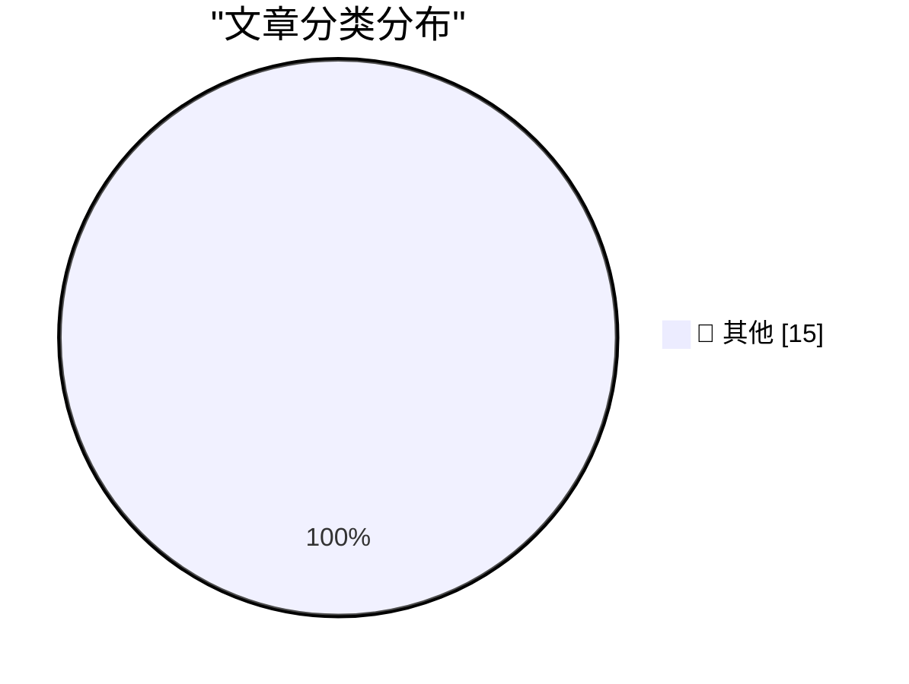

# 📰 AI 博客每日精选 — 2026-03-24

> 来自 Karpathy 推荐的 92 个顶级技术博客，AI 精选 Top 15

## 🏆 今日必读

🥇 **Quoting Neurotica**

[Quoting Neurotica](https://simonwillison.net/2026/Mar/23/neurotica/#atom-everything) — simonwillison.net · 4 小时前 · 📝 其他

> Quoting Neurotica

🥈 **datasette-files 0.1a2**

[datasette-files 0.1a2](https://simonwillison.net/2026/Mar/23/datasette-files/#atom-everything) — simonwillison.net · 4 小时前 · 📝 其他

> datasette-files 0.1a2

🥉 **Quoting David Abram**

[Quoting David Abram](https://simonwillison.net/2026/Mar/23/david-abram/#atom-everything) — simonwillison.net · 9 小时前 · 📝 其他

> Quoting David Abram

---

## 📊 数据概览

| 扫描源 | 抓取文章 | 时间范围 | 精选 |
|:---:|:---:|:---:|:---:|
| 88/92 | 2516 篇 → 15 篇 | 24h | **15 篇** |

### 分类分布

---

## 📝 其他

### 1. Quoting Neurotica

[Quoting Neurotica](https://simonwillison.net/2026/Mar/23/neurotica/#atom-everything) — **simonwillison.net** · 4 小时前 · ⭐ 15/30

> Quoting Neurotica

---

### 2. datasette-files 0.1a2

[datasette-files 0.1a2](https://simonwillison.net/2026/Mar/23/datasette-files/#atom-everything) — **simonwillison.net** · 4 小时前 · ⭐ 15/30

> datasette-files 0.1a2

---

### 3. Quoting David Abram

[Quoting David Abram](https://simonwillison.net/2026/Mar/23/david-abram/#atom-everything) — **simonwillison.net** · 9 小时前 · ⭐ 15/30

> Quoting David Abram

---

### 4. ‘CanisterWorm’ Springs Wiper Attack Targeting Iran

[‘CanisterWorm’ Springs Wiper Attack Targeting Iran](https://krebsonsecurity.com/2026/03/canisterworm-springs-wiper-attack-targeting-iran/) — **krebsonsecurity.com** · 12 小时前 · ⭐ 15/30

> ‘CanisterWorm’ Springs Wiper Attack Targeting Iran

---

### 5. [Sponsor] npx workos: From Auth Integration to Environment Management, Zero ClickOps

[[Sponsor] npx workos: From Auth Integration to Environment Management, Zero ClickOps](https://workos.com/docs/authkit/cli-installer?utm_source=daringfireball&amp;utm_medium=newsletter&amp;utm_campaign=q12026) — **daringfireball.net** · 3 小时前 · ⭐ 15/30

> [Sponsor] npx workos: From Auth Integration to Environment Management, Zero ClickOps

---

### 6. Gasoline Prices Around the World

[Gasoline Prices Around the World](https://www.globalpetrolprices.com/gasoline_prices/) — **daringfireball.net** · 7 小时前 · ⭐ 15/30

> Gasoline Prices Around the World

---

### 7. WWDC 2026: June 8–12

[WWDC 2026: June 8–12](https://www.apple.com/newsroom/2026/03/apples-worldwide-developers-conference-returns-the-week-of-june-8/) — **daringfireball.net** · 9 小时前 · ⭐ 15/30

> WWDC 2026: June 8–12

---

### 8. From the DF Archive, a Decade Ago: ‘The Industry Is Fucked Up’

[From the DF Archive, a Decade Ago: ‘The Industry Is Fucked Up’](https://daringfireball.net/linked/2015/07/09/ritchie-bad-ads) — **daringfireball.net** · 9 小时前 · ⭐ 15/30

> From the DF Archive, a Decade Ago: ‘The Industry Is Fucked Up’

---

### 9. The HTML Review: Issue 05

[The HTML Review: Issue 05](https://thehtml.review/05/) — **daringfireball.net** · 10 小时前 · ⭐ 15/30

> The HTML Review: Issue 05

---

### 10. Pluralistic: Understaffing as a form of enshittification (23 Mar 2026)

[Pluralistic: Understaffing as a form of enshittification (23 Mar 2026)](https://pluralistic.net/2026/03/22/nobodys-home/) — **pluralistic.net** · 22 小时前 · ⭐ 15/30

> Pluralistic: Understaffing as a form of enshittification (23 Mar 2026)

---

### 11. How can I make sure the anti-malware software doesn’t terminate my custom service?

[How can I make sure the anti-malware software doesn’t terminate my custom service?](https://devblogs.microsoft.com/oldnewthing/20260323-00/?p=112157) — **devblogs.microsoft.com/oldnewthing** · 14 小时前 · ⭐ 15/30

> How can I make sure the anti-malware software doesn’t terminate my custom service?

---

### 12. Set intersection and difference at the command line

[Set intersection and difference at the command line](https://www.johndcook.com/blog/2026/03/23/intersection-difference/) — **johndcook.com** · 16 小时前 · ⭐ 15/30

> Set intersection and difference at the command line

---

### 13. Writing an LLM from scratch, part 32f -- Interventions: weight decay

[Writing an LLM from scratch, part 32f -- Interventions: weight decay](https://www.gilesthomas.com/2026/03/llm-from-scratch-32f-interventions-weight-decay) — **gilesthomas.com** · 4 小时前 · ⭐ 15/30

> Writing an LLM from scratch, part 32f -- Interventions: weight decay

---

### 14. What came after 486?

[What came after 486?](https://dfarq.homeip.net/what-came-after-486/?utm_source=rss&#038;utm_medium=rss&#038;utm_campaign=what-came-after-486) — **dfarq.homeip.net** · 17 小时前 · ⭐ 15/30

> What came after 486?

---

### 15. Markdown Ate The World

[Markdown Ate The World](https://matduggan.com/markdown-ate-the-world/) — **matduggan.com** · 15 小时前 · ⭐ 15/30

> Markdown Ate The World

---

*生成于 2026-03-24 04:01 | 扫描 88 源 → 获取 2516 篇 → 精选 15 篇*
*基于 [Hacker News Popularity Contest 2025](https://refactoringenglish.com/tools/hn-popularity/) RSS 源列表，由 [Andrej Karpathy](https://x.com/karpathy) 推荐*
*由「懂点儿AI」制作，欢迎关注同名微信公众号获取更多 AI 实用技巧 💡*
