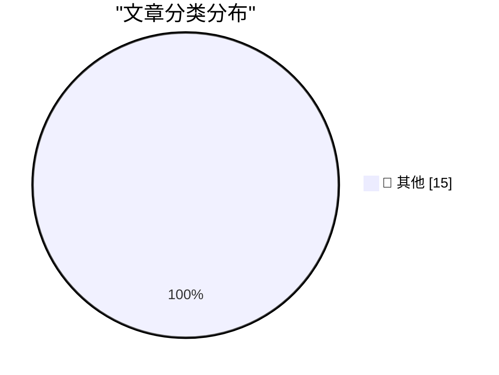

# 📰 AI 博客每日精选 — 2026-03-25

> 来自 Karpathy 推荐的 92 个顶级技术博客，AI 精选 Top 15

## 🏆 今日必读

🥇 **Auto mode for Claude Code**

[Auto mode for Claude Code](https://simonwillison.net/2026/Mar/24/auto-mode-for-claude-code/#atom-everything) — simonwillison.net · 4 小时前 · 📝 其他

> Auto mode for Claude Code

🥈 **Package Managers Need to Cool Down**

[Package Managers Need to Cool Down](https://simonwillison.net/2026/Mar/24/package-managers-need-to-cool-down/#atom-everything) — simonwillison.net · 6 小时前 · 📝 其他

> Package Managers Need to Cool Down

🥉 **Quoting Christopher Mims**

[Quoting Christopher Mims](https://simonwillison.net/2026/Mar/24/christopher-mims/#atom-everything) — simonwillison.net · 7 小时前 · 📝 其他

> Quoting Christopher Mims

---

## 📊 数据概览

| 扫描源 | 抓取文章 | 时间范围 | 精选 |
|:---:|:---:|:---:|:---:|
| 89/92 | 2527 篇 → 26 篇 | 24h | **15 篇** |

### 分类分布

---

## 📝 其他

### 1. Auto mode for Claude Code

[Auto mode for Claude Code](https://simonwillison.net/2026/Mar/24/auto-mode-for-claude-code/#atom-everything) — **simonwillison.net** · 4 小时前 · ⭐ 15/30

> Auto mode for Claude Code

---

### 2. Package Managers Need to Cool Down

[Package Managers Need to Cool Down](https://simonwillison.net/2026/Mar/24/package-managers-need-to-cool-down/#atom-everything) — **simonwillison.net** · 6 小时前 · ⭐ 15/30

> Package Managers Need to Cool Down

---

### 3. Quoting Christopher Mims

[Quoting Christopher Mims](https://simonwillison.net/2026/Mar/24/christopher-mims/#atom-everything) — **simonwillison.net** · 7 小时前 · ⭐ 15/30

> Quoting Christopher Mims

---

### 4. Malicious litellm_init.pth in litellm 1.82.8 — credential stealer

[Malicious litellm_init.pth in litellm 1.82.8 — credential stealer](https://simonwillison.net/2026/Mar/24/malicious-litellm/#atom-everything) — **simonwillison.net** · 12 小时前 · ⭐ 15/30

> Malicious litellm_init.pth in litellm 1.82.8 — credential stealer

---

### 5. Streaming experts

[Streaming experts](https://simonwillison.net/2026/Mar/24/streaming-experts/#atom-everything) — **simonwillison.net** · 22 小时前 · ⭐ 15/30

> Streaming experts

---

### 6. Using FireWire on a Raspberry Pi

[Using FireWire on a Raspberry Pi](https://www.jeffgeerling.com/blog/2026/firewire-on-a-raspberry-pi/) — **jeffgeerling.com** · 12 小时前 · ⭐ 15/30

> Using FireWire on a Raspberry Pi

---

### 7. Claude Can Now Take Control of Your Mac

[Claude Can Now Take Control of Your Mac](https://claude.com/blog/dispatch-and-computer-use) — **daringfireball.net** · 2 小时前 · ⭐ 15/30

> Claude Can Now Take Control of Your Mac

---

### 8. WSJ: ‘OpenAI Plans Launch of Desktop “Superapp”’

[WSJ: ‘OpenAI Plans Launch of Desktop “Superapp”’](https://www.wsj.com/tech/openai-plans-launch-of-desktop-superapp-to-refocus-simplify-user-experience-9e19931d?st=25wiu1) — **daringfireball.net** · 3 小时前 · ⭐ 15/30

> WSJ: ‘OpenAI Plans Launch of Desktop “Superapp”’

---

### 9. OpenAI Is Closing Sora

[OpenAI Is Closing Sora](https://x.com/soraofficialapp/status/2036546752535470382) — **daringfireball.net** · 3 小时前 · ⭐ 15/30

> OpenAI Is Closing Sora

---

### 10. iOS 26.4

[iOS 26.4](https://www.macrumors.com/guide/ios-26-4-features/) — **daringfireball.net** · 3 小时前 · ⭐ 15/30

> iOS 26.4

---

### 11. Following Google’s Lead With Pixel Phones, Samsung Announces AirDrop Support With Galaxy S26 Phones

[Following Google’s Lead With Pixel Phones, Samsung Announces AirDrop Support With Galaxy S26 Phones](https://news.samsung.com/us/samsung-airdrop-quick-share-galaxy-s26-series/) — **daringfireball.net** · 6 小时前 · ⭐ 15/30

> Following Google’s Lead With Pixel Phones, Samsung Announces AirDrop Support With Galaxy S26 Phones

---

### 12. ★ What to Do About Those Menu Item Icons in MacOS 26 Tahoe

[★ What to Do About Those Menu Item Icons in MacOS 26 Tahoe](https://daringfireball.net/2026/03/what_to_do_about_those_menu_item_icons_in_macos_26_tahoe) — **daringfireball.net** · 8 小时前 · ⭐ 15/30

> ★ What to Do About Those Menu Item Icons in MacOS 26 Tahoe

---

### 13. Pluralistic: Goodhart's Law vs "prediction markets" (24 Mar 2026)

[Pluralistic: Goodhart's Law vs "prediction markets" (24 Mar 2026)](https://pluralistic.net/2026/03/24/degenerated-gambling/) — **pluralistic.net** · 16 小时前 · ⭐ 15/30

> Pluralistic: Goodhart's Law vs "prediction markets" (24 Mar 2026)

---

### 14. Book Review: If We Cannot Go at the Speed of Light by Kim Choyeop ★★☆☆☆

[Book Review: If We Cannot Go at the Speed of Light by Kim Choyeop ★★☆☆☆](https://shkspr.mobi/blog/2026/03/book-review-if-we-cannot-go-at-the-speed-of-light-by-kim-choyeop/) — **shkspr.mobi** · 15 小时前 · ⭐ 15/30

> Book Review: If We Cannot Go at the Speed of Light by Kim Choyeop ★★☆☆☆

---

### 15. Windows 95 defenses against installers that overwrite a file with an older version

[Windows 95 defenses against installers that overwrite a file with an older version](https://devblogs.microsoft.com/oldnewthing/20260324-00/?p=112159) — **devblogs.microsoft.com/oldnewthing** · 14 小时前 · ⭐ 15/30

> Windows 95 defenses against installers that overwrite a file with an older version

---

*生成于 2026-03-25 04:03 | 扫描 89 源 → 获取 2527 篇 → 精选 15 篇*
*基于 [Hacker News Popularity Contest 2025](https://refactoringenglish.com/tools/hn-popularity/) RSS 源列表，由 [Andrej Karpathy](https://x.com/karpathy) 推荐*
*由「懂点儿AI」制作，欢迎关注同名微信公众号获取更多 AI 实用技巧 💡*
