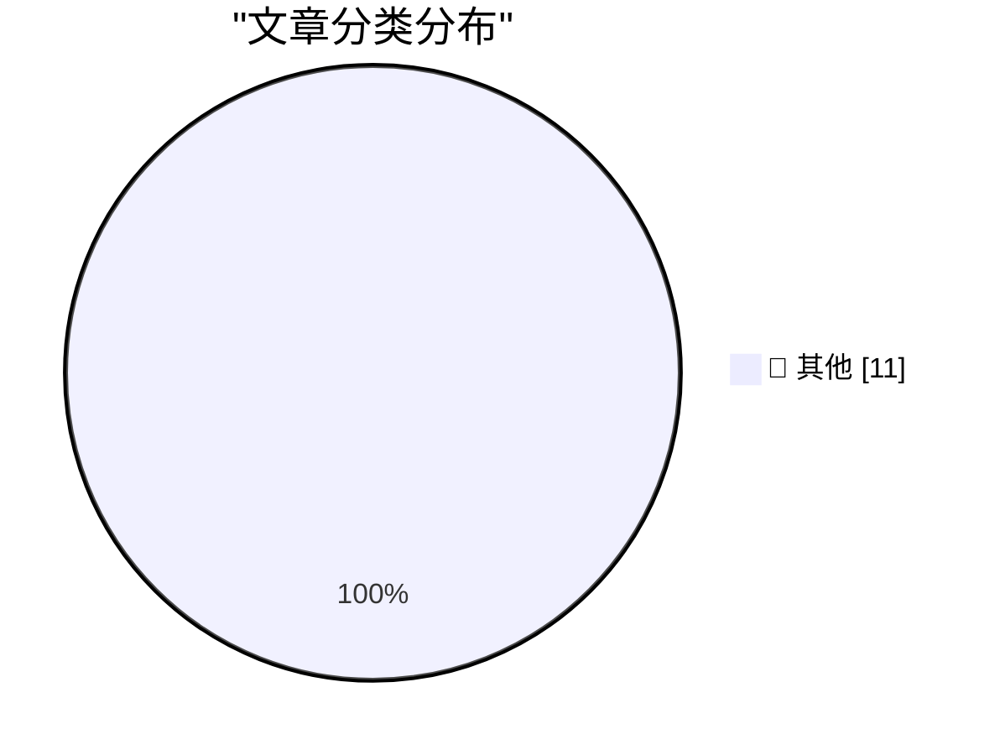

# 📰 AI 博客每日精选 — 2026-03-26

> 来自 Karpathy 推荐的 92 个顶级技术博客，AI 精选 Top 11

## 🏆 今日必读

🥇 **datasette-files-s3 0.1a1**

[datasette-files-s3 0.1a1](https://simonwillison.net/2026/Mar/25/datasette-files-s3/#atom-everything) — simonwillison.net · 6 小时前 · 📝 其他

> datasette-files-s3 0.1a1

🥈 **Thoughts on slowing the fuck down**

[Thoughts on slowing the fuck down](https://simonwillison.net/2026/Mar/25/thoughts-on-slowing-the-fuck-down/#atom-everything) — simonwillison.net · 6 小时前 · 📝 其他

> Thoughts on slowing the fuck down

🥉 **datasette-llm 0.1a1**

[datasette-llm 0.1a1](https://simonwillison.net/2026/Mar/25/datasette-llm/#atom-everything) — simonwillison.net · 6 小时前 · 📝 其他

> datasette-llm 0.1a1

---

## 📊 数据概览

| 扫描源 | 抓取文章 | 时间范围 | 精选 |
|:---:|:---:|:---:|:---:|
| 88/92 | 2518 篇 → 11 篇 | 24h | **11 篇** |

### 分类分布

---

## 📝 其他

### 1. datasette-files-s3 0.1a1

[datasette-files-s3 0.1a1](https://simonwillison.net/2026/Mar/25/datasette-files-s3/#atom-everything) — **simonwillison.net** · 6 小时前 · ⭐ 15/30

> datasette-files-s3 0.1a1

---

### 2. Thoughts on slowing the fuck down

[Thoughts on slowing the fuck down](https://simonwillison.net/2026/Mar/25/thoughts-on-slowing-the-fuck-down/#atom-everything) — **simonwillison.net** · 6 小时前 · ⭐ 15/30

> Thoughts on slowing the fuck down

---

### 3. datasette-llm 0.1a1

[datasette-llm 0.1a1](https://simonwillison.net/2026/Mar/25/datasette-llm/#atom-everything) — **simonwillison.net** · 6 小时前 · ⭐ 15/30

> datasette-llm 0.1a1

---

### 4. LiteLLM Hack: Were You One of the 47,000?

[LiteLLM Hack: Were You One of the 47,000?](https://simonwillison.net/2026/Mar/25/litellm-hack/#atom-everything) — **simonwillison.net** · 10 小时前 · ⭐ 15/30

> LiteLLM Hack: Were You One of the 47,000?

---

### 5. ‘A List of Chain Restaurants Whose Names Contain Unusual Structures’

[‘A List of Chain Restaurants Whose Names Contain Unusual Structures’](https://onefoottsunami.com/2026/03/18/a-list-of-chain-restaurants-whose-names-contain-unusual-structures/) — **daringfireball.net** · 8 小时前 · ⭐ 15/30

> ‘A List of Chain Restaurants Whose Names Contain Unusual Structures’

---

### 6. Improved Analytics in App Store Connect

[Improved Analytics in App Store Connect](https://developer.apple.com/news/?id=hh6v4b55) — **daringfireball.net** · 8 小时前 · ⭐ 15/30

> Improved Analytics in App Store Connect

---

### 7. Pluralistic: The cost of doing business (25 Mar 2026)

[Pluralistic: The cost of doing business (25 Mar 2026)](https://pluralistic.net/2026/03/25/fact-intensive/) — **pluralistic.net** · 20 小时前 · ⭐ 15/30

> Pluralistic: The cost of doing business (25 Mar 2026)

---

### 8. How can I change a dialog box’s message loop to do a Msg­Wait­For­Multiple­Objects instead of Get­Message?

[How can I change a dialog box’s message loop to do a Msg­Wait­For­Multiple­Objects instead of Get­Message?](https://devblogs.microsoft.com/oldnewthing/20260325-00/?p=112165) — **devblogs.microsoft.com/oldnewthing** · 14 小时前 · ⭐ 15/30

> How can I change a dialog box’s message loop to do a Msg­Wait­For­Multiple­Objects instead of Get­Message?

---

### 9. War and AI, the death of Sora, and 3 ways you can catch me live today

[War and AI, the death of Sora, and 3 ways you can catch me live today](https://garymarcus.substack.com/p/war-and-ai-the-death-of-sora-and) — **garymarcus.substack.com** · 14 小时前 · ⭐ 15/30

> War and AI, the death of Sora, and 3 ways you can catch me live today

---

### 10. The Top 10 Biggest Conspiracies in Open Source

[The Top 10 Biggest Conspiracies in Open Source](https://nesbitt.io/2026/03/25/the-top-10-biggest-conspiracies-in-open-source.html) — **nesbitt.io** · 18 小时前 · ⭐ 15/30

> The Top 10 Biggest Conspiracies in Open Source

---

### 11. Steve Ballmer, Microsoft executive and NBA owner

[Steve Ballmer, Microsoft executive and NBA owner](https://dfarq.homeip.net/steve-ballmer-microsoft-executive-and-nba-owner/?utm_source=rss&#038;utm_medium=rss&#038;utm_campaign=steve-ballmer-microsoft-executive-and-nba-owner) — **dfarq.homeip.net** · 17 小时前 · ⭐ 15/30

> Steve Ballmer, Microsoft executive and NBA owner

---

*生成于 2026-03-26 04:00 | 扫描 88 源 → 获取 2518 篇 → 精选 11 篇*
*基于 [Hacker News Popularity Contest 2025](https://refactoringenglish.com/tools/hn-popularity/) RSS 源列表，由 [Andrej Karpathy](https://x.com/karpathy) 推荐*
*由「懂点儿AI」制作，欢迎关注同名微信公众号获取更多 AI 实用技巧 💡*
